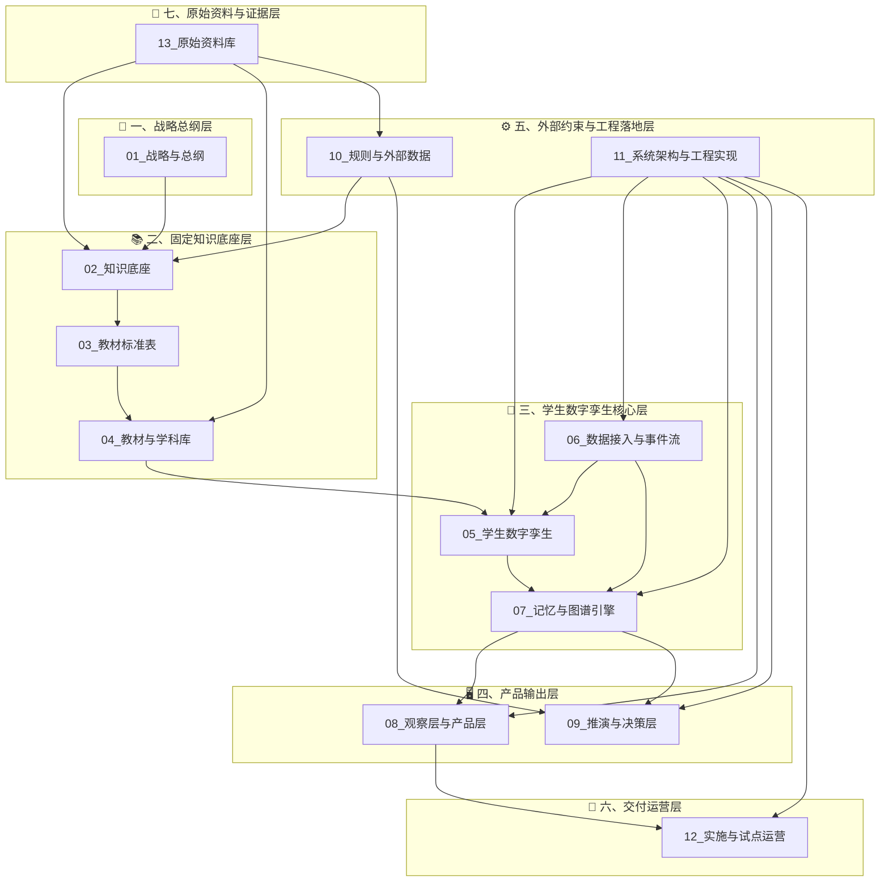
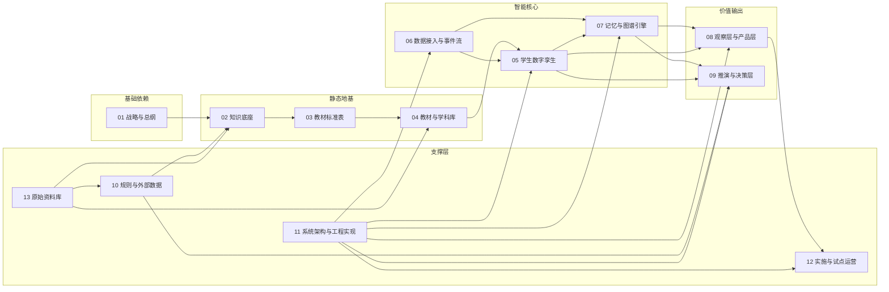

# 教育孪生项目 · 文档导航总图

> 文档编号：NAV-001  
> 版本：V1.0  
> 创建日期：2024  
> 最后更新：待定  
> 维护人：项目负责人

---

## 一、快速入口

| 你需要找 | 直接跳转 |
|----------|----------|
| 项目是什么、为什么做 | [01_战略与总纲](./01_战略与总纲/) |
| 知识底座怎么建 | [02_知识底座](./02_知识底座/) |
| 教材标准表规范 | [03_教材标准表](./03_教材标准表/) |
| 学生数字孪生设计 | [05_学生数字孪生](./05_学生数字孪生/) |
| 数据接入与事件流 | [06_数据接入与事件流](./06_数据接入与事件流/) |
| 图谱记忆引擎 | [07_记忆与图谱引擎](./07_记忆与图谱引擎/) |
| 前台产品观察层 | [08_观察层与产品层](./08_观察层与产品层/) |
| 后台推演决策层 | [09_推演与决策层](./09_推演与决策层/) |
| 系统架构与工程 | [11_系统架构与工程实现](./11_系统架构与工程实现/) |
| 试点运营交付 | [12_实施与试点运营](./12_实施与试点运营/) |

---

## 二、项目文档结构总图



---

## 三、文档依赖关系图



---

## 四、核心逻辑一句话

| 层级 | 核心作用 | 一句话定义 |
|------|----------|------------|
| 01 战略与总纲 | 定方向 | 项目是什么、为什么做、阶段目标 |
| 02 知识底座 | 定世界 | 教材知识点的标准化存储结构 |
| 03 教材标准表 | 定规范 | 章节树/知识点/能力点的表结构标准 |
| 04 教材与学科库 | 定内容 | 具体学科的结构化知识地图 |
| 05 学生数字孪生 | 定个体 | 每个学生的 StudentTwinAgent 设计 |
| 06 数据接入与事件流 | 定输入 | 微信/钉钉/扫描仪的数据输入规范 |
| 07 记忆与图谱引擎 | 定上下文 | 图谱记忆、GraphRAG、时序记录 |
| 08 观察层与产品层 | 定输出 | 家长端/老师端/学校端的展示规则 |
| 09 推演与决策层 | 定未来 | 干预推演、风险预测、志愿填报 |
| 10 规则与外部数据 | 定约束 | 地区规则、高考数据、政策口径 |
| 11 系统架构与工程实现 | 定落地 | 技术架构、API、部署运维 |
| 12 实施与试点运营 | 定交付 | 学校接入、试点实施、反馈闭环 |
| 13 原始资料库 | 定证据 | 教材 PDF、政策资料、历史版本 |

---

## 五、编写优先级

### P0：核心骨架（立即启动）

| 优先级 | 文档路径 | 文档编号 | 状态 | 负责人 |
|--------|----------|----------|------|--------|
| P0-1 | `01_战略与总纲/02_项目需求总纲.md` | STR-002 | 草稿中 | - |
| P0-2 | `02_知识底座/01_固定知识底座设计框架.md` | KB-001 | 未开始 | - |
| P0-3 | `05_学生数字孪生/01_StudentTwinAgent 总体设计.md` | TWIN-001 | 未开始 | - |
| P0-4 | `11_系统架构与工程实现/01_总体技术架构.md` | ARCH-001 | 未开始 | - |

### P1：关键规范（核心骨架完成后启动）

| 优先级 | 文档路径 | 文档编号 | 状态 | 负责人 |
|--------|----------|----------|------|--------|
| P1-1 | `02_知识底座/04_教材首轮入库标准.md` | KB-004 | 未开始 | - |
| P1-2 | `03_教材标准表/01_章节树表标准.md` | STD-001 | 未开始 | - |
| P1-3 | `03_教材标准表/02_知识点表标准.md` | STD-002 | 未开始 | - |
| P1-4 | `06_数据接入与事件流/07_学习事件生成标准.md` | INGEST-007 | 未开始 | - |
| P1-5 | `07_记忆与图谱引擎/01_图谱记忆层设计.md` | GRAPH-001 | 未开始 | - |

### P2：内容填充（P1 完成后启动）

| 优先级 | 文档路径 | 文档编号 | 状态 | 负责人 |
|--------|----------|----------|------|--------|
| P2-1 | `04_教材与学科库/高中物理/章节树/高中物理必修一知识树_V1.md` | MAT-PHYS-001 | 未开始 | - |
| P2-2 | `05_学生数字孪生/02_学生 Agent 字段设计.md` | TWIN-002 | 未开始 | - |
| P2-3 | `08_观察层与产品层/01_前台观察层设计.md` | OBS-001 | 未开始 | - |
| P2-4 | `09_推演与决策层/01_后台推演层设计.md` | SIM-001 | 未开始 | - |

### P3：支撑与交付（按需启动）

| 优先级 | 文档路径 | 文档编号 | 状态 | 负责人 |
|--------|----------|----------|------|--------|
| P3-1 | `10_规则与外部数据/01_地区规则接入标准.md` | RULE-001 | 未开始 | - |
| P3-2 | `12_实施与试点运营/01_学校接入流程.md` | OPS-001 | 未开始 | - |
| P3-3 | `11_系统架构与工程实现/04_API 与事件接口规范.md` | ARCH-004 | 未开始 | - |

---

## 六、一级目录状态总览

| 目录编号 | 目录名称 | 当前状态 | 文档数量 | 负责人 | 备注 |
|----------|----------|----------|----------|--------|------|
| 01 | 战略与总纲 | 🟡 进行中 | 1/9 | - | 需求总纲已创建 |
| 02 | 知识底座 | 🔴 未开始 | 0/9 | - | 等待 P0 完成后启动 |
| 03 | 教材标准表 | 🔴 未开始 | 0/12 | - | 等待 P0 完成后启动 |
| 04 | 教材与学科库 | 🔴 未开始 | 0/∞ | - | 依赖 03 标准表完成 |
| 05 | 学生数字孪生 | 🟡 进行中 | 0/12 | - | P0 优先级，待启动 |
| 06 | 数据接入与事件流 | 🔴 未开始 | 0/11 | - | P1 优先级 |
| 07 | 记忆与图谱引擎 | 🔴 未开始 | 0/10 | - | P1 优先级 |
| 08 | 观察层与产品层 | 🔴 未开始 | 0/10 | - | P2 优先级 |
| 09 | 推演与决策层 | 🔴 未开始 | 0/12 | - | P2 优先级 |
| 10 | 规则与外部数据 | 🔴 未开始 | 0/∞ | - | P3 优先级 |
| 11 | 系统架构与工程实现 | 🟡 进行中 | 0/12 | - | P0 优先级，待启动 |
| 12 | 实施与试点运营 | 🔴 未开始 | 0/8 | - | P3 优先级 |
| 13 | 原始资料库 | 🔴 未开始 | 0/∞ | - | 资料收集阶段 |

**状态图例**：
- 🟢 已完成：核心文档已冻结
- 🟡 进行中：已有草稿或部分完成
- 🔴 未开始：尚未启动
- ⚪ 已归档：历史版本归档

---

## 七、文档编号规则

### 编号前缀表

| 前缀 | 类别 | 示例 |
|------|------|------|
| `STR` | 战略类 | STR-001 项目定位 |
| `KB` | 知识底座类 | KB-001 固定知识底座设计框架 |
| `STD` | 标准表类 | STD-001 章节树表标准 |
| `MAT` | 教材与学科库 | MAT-PHYS-001 高中物理必修一知识树 |
| `TWIN` | 学生孪生类 | TWIN-001 StudentTwinAgent 总体设计 |
| `INGEST` | 数据接入类 | INGEST-007 学习事件生成标准 |
| `GRAPH` | 图谱类 | GRAPH-001 图谱记忆层设计 |
| `OBS` | 观察层类 | OBS-001 前台观察层设计 |
| `SIM` | 推演类 | SIM-001 后台推演层设计 |
| `RULE` | 外部规则类 | RULE-001 地区规则接入标准 |
| `ARCH` | 架构类 | ARCH-001 总体技术架构 |
| `OPS` | 试点运营类 | OPS-001 学校接入流程 |
| `RAW` | 原始资料类 | RAW-001 教材 PDF 入库记录 |
| `NAV` | 导航类 | NAV-001 项目文档导航总图 |

### 编号格式

```
[前缀]-[三位序号]
```

示例：
- `STR-002` = 战略类第 2 号文档
- `TWIN-001` = 学生孪生类第 1 号文档
- `MAT-PHYS-001` = 教材库 - 物理学科第 1 号文档

---

## 八、文档状态定义

| 状态 | 定义 | 可被引用 | 可评审 |
|------|------|----------|--------|
| 未开始 | 尚未创建 | ❌ | ❌ |
| 草稿中 | 正在编写，内容不完整 | ❌ | ❌ |
| 可评审 | 内容完整，等待评审 | ✅ | ✅ |
| 已冻结 | 评审通过，版本锁定 | ✅ | ❌ |
| 已归档 | 历史版本，被新版替代 | ❌ | ❌ |

---

## 九、命名统一口径

| 名称类型 | 统一名称 | 备注 |
|----------|----------|------|
| 总项目名 | 教育孪生项目 | 内部项目代号 |
| 产品名 | 课课 | 对外产品名称 |
| 核心智能体 | StudentTwinAgent | 学生数字孪生智能体 |
| 前台层 | 前台观察层 | 面向用户的产品展示层 |
| 后台层 | 后台推演层 | 干预建议与决策模拟层 |
| 底层地图 | 固定知识底座 | 教材知识点的标准化存储结构 |
| 图谱引擎 | 记忆与图谱引擎 | 包含 GraphRAG、时序记忆 |
| 数据输入 | 数据接入与事件流 | 微信/钉钉/扫描仪等输入渠道 |

---

## 十、变更历史

| 版本 | 日期 | 变更人 | 变更内容 |
|------|------|--------|----------|
| V1.0 | 待定 | - | 初始版本，建立导航框架 |

---

## 十一、相关文档

- [根目录 README.md](./README.md) - 项目总入口
- [01_战略与总纲/02_项目需求总纲.md](./01_战略与总纲/02_项目需求总纲.md) - 需求总纲
- [11_系统架构与工程实现/01_总体技术架构.md](./11_系统架构与工程实现/01_总体技术架构.md) - 技术架构（待创建）

---

**维护说明**：
- 本文档由项目负责人维护
- 每次新增一级目录或核心文档时需同步更新
- 文档状态每月Review一次

## 与其他文档的关系

| 文档 | 关联文档 | 关系说明 |
|------|----------|----------|
| NAV-001 项目文档导航总图 | NAV-002 README.md | 导航总图与根目录 README 互为补充 |
| NAV-001 项目文档导航总图 | NAV-003 文档状态总表 | 导航总图与状态总表互为补充 |
| NAV-001 项目文档导航总图 | NAV-004 全库编号与引用统一规范 | 导航总图引用编号规范 |
| NAV-001 项目文档导航总图 | NAV-005 方案 B 全量清洗最终验收标准 | 导航总图引用验收标准 |
| NAV-001 项目文档导航总图 | STR-001 项目定位 | 导航总图指向项目定位文档 |
| NAV-001 项目文档导航总图 | KB-001 固定知识底座设计框架 | 导航总图指向知识底座文档 |
