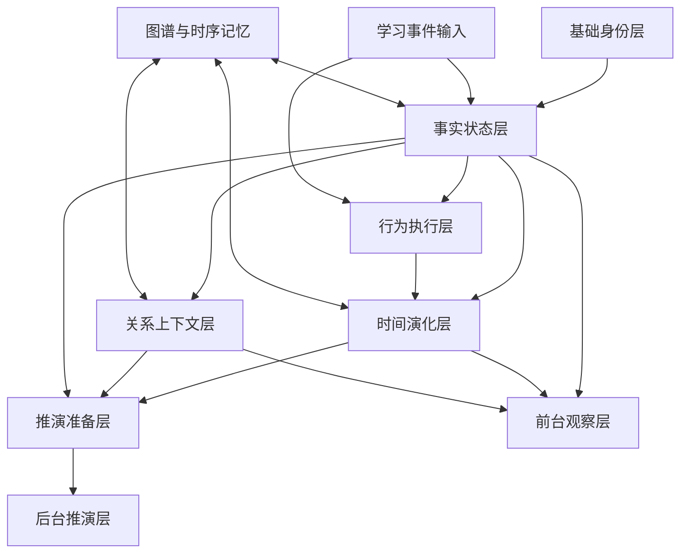

# 个体 Agent 内部结构图

> 文档编号：TWIN-008
> 版本：V1.0
> 创建日期：2024
> 最后更新：待定
> 维护人：学生数字孪生负责人

---

## 1. 文档目的

本文档用于以结构图方式描述 StudentTwinAgent 的内部模块组成、层间关系和主要输入输出路径，作为 StudentTwinAgent 总体设计的结构化图示补充。

---

## 2. 结构图说明

StudentTwinAgent 不是一个单层对象，而是由多个内聚层共同组成：

- 基础身份层
- 事实状态层
- 行为执行层
- 时间演化层
- 关系上下文层
- 推演准备层
- 外部记忆连接层

这些层之间不是并列拼接，而是有明显的数据流与依赖关系。

---

## 3. Mermaid 结构图

---

## 4. 各层含义简述

### 4.1 基础身份层

定义学生是谁、属于哪里、适用哪套教育环境。

### 4.2 事实状态层

记录已确认、可直接引用的客观状态。

### 4.3 行为执行层

记录学生在学习过程中如何执行任务、作业和纠错。

### 4.4 时间演化层

表达学生状态如何随时间变化。

### 4.5 关系上下文层

表达学生与家长、老师、班级和学校之间的教育关系背景。

### 4.6 推演准备层

将前面几层压缩为可供后台推演的结构化输入。

### 4.7 外部记忆连接层

与图谱记忆、时序记忆和上下文装配规则联动。

---

## 5. 数据流说明

### 5.1 输入流

学习事件进入后，优先影响：

- 事实状态层
- 行为执行层

### 5.2 推导流

基于事实状态和行为执行，形成：

- 时间演化层
- 关系上下文层

### 5.3 输出流

- 观察层主要消费事实状态、时间演化、关系上下文
- 推演层主要消费推演准备层

---

## 6. 结论

StudentTwinAgent 的内部结构不是单一大对象，而是一个“当前态 + 行为层 + 演化层 + 上下文层 + 推演准备层”共同工作的多层结构体。

这张图的作用，是保证团队后续写字段、写状态机、写接口、写编排时，始终围绕同一结构理解。
