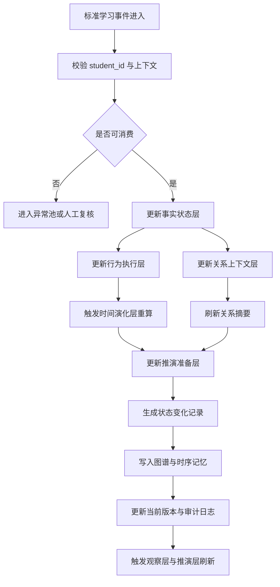

# Agent 更新流程图

> 文档编号：TWIN-009
> 版本：V1.0
> 创建日期：2024
> 最后更新：待定
> 维护人：学生数字孪生负责人

---

## 1. 文档目的

本文档用于描述 StudentTwinAgent 在接收到新学习事件、人工校准输入或关系修正输入后，如何完成分层更新、变化留痕、记忆写入与下游刷新。

---

## 2. 流程设计原则

- 先校验，后更新
- 先局部层，后派生层
- 先当前态，后长期记忆
- 先留痕，后触发下游
- 异常对象必须可回退、可复核

---

## 3. Mermaid 更新流程图

---

## 4. 关键步骤说明

### 4.1 事件校验

在进入 Agent 更新前，至少确认：

- 学生对象存在
- 基础绑定未失效
- 事件没有重复消费
- 事件可信度达到最低门槛
- 来源和时间语义完整

### 4.2 局部层更新

优先更新最贴近输入事实的层：

- 事实状态层
- 行为执行层
- 关系上下文层

### 4.3 派生层更新

在局部层稳定后，再更新：

- 时间演化层
- 推演准备层
- 风险相关摘要

### 4.4 留痕与写回

最终需要完成：

- 状态变化记录
- 图谱写入
- 时序记忆写入
- 审计日志写入
- 版本号推进

---

## 5. 异常分支建议

当出现以下情况时，应转入异常分支而非直接更新：

- student_id 错配
- 关键绑定缺失
- 事件字段不完整
- 同一事件重复写入
- OCR 或映射结果置信度过低
- 关系冲突严重

---

## 6. 结论

StudentTwinAgent 的更新不是一次简单覆盖，而是一条事件驱动、分层更新、可追溯、可回退的内部流水线。

## 与其他文档的关系

| 文档 | 关联文档 | 关系说明 |
|------|----------|----------|
| TWIN-009 Agent 更新流程图 | TWIN-001 StudentTwinAgent 总体设计 | 本文档是总体设计的更新流程展开 |
| TWIN-009 Agent 更新流程图 | TWIN-008 个体 Agent 内部结构图 | 更新流程基于结构图设计 |
| TWIN-009 Agent 更新流程图 | TWIN-010 Agent 状态机设计 | 更新流程驱动状态机转换 |
| TWIN-009 Agent 更新流程图 | INGEST-007 学习事件生成标准 | 学习事件触发 Agent 更新 |
