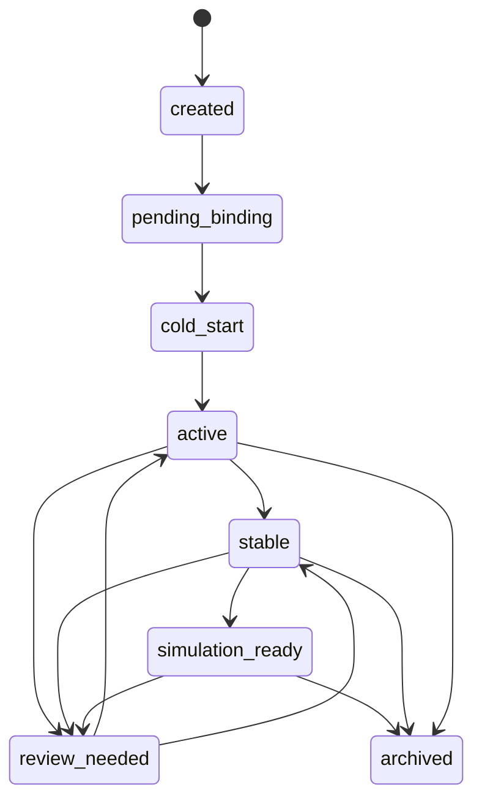

# Agent 状态机设计

> 文档编号：TWIN-010
> 版本：V1.0
> 创建日期：2024
> 最后更新：待定
> 维护人：学生数字孪生负责人

---

## 1. 文档目的

本文档用于定义 StudentTwinAgent 的生命周期状态机、状态切换条件、异常状态与恢复规则。

---

## 2. 为什么需要状态机

StudentTwinAgent 不是创建出来就永远是一个稳定对象。
它会经历：

- 创建
- 冷启动
- 激活
- 稳定积累
- 推演可用
- 异常待修复
- 归档

状态机的意义是明确：

- 当前这个 Agent 处在什么阶段
- 能做什么
- 不能做什么
- 发生问题时如何处理

---

## 3. 状态定义建议

建议至少包含以下状态：

- `created`
- `pending_binding`
- `cold_start`
- `active`
- `stable`
- `simulation_ready`
- `review_needed`
- `archived`

---

## 4. 各状态说明

### created

学生对象刚创建，但尚未完成必要绑定。

### pending_binding

学校、地区、教材等绑定尚未齐全。

### cold_start

已可运行，但数据较少，状态判断较弱。

### active

已有持续输入，可正常更新和输出基础观察。

### stable

状态与时序链较稳定，可支持更可靠观察输出。

### simulation_ready

已满足基础推演准入条件。

### review_needed

当前对象存在严重冲突、映射问题或数据异常，需要复核。

### archived

学生毕业、离开系统或长期停用，进入归档。

---

## 5. 状态切换建议

---

## 6. 状态切换条件建议

### created -> pending_binding

学生基础对象建立完成。

### pending_binding -> cold_start

学校、地区、教材等绑定基本完成。

### cold_start -> active

已进入持续事件输入，能形成基础状态更新。

### active -> stable

已有较完整数据和连续时间窗口支撑。

### stable -> simulation_ready

满足推演准备层的准入要求。

### 任意运行态 -> review_needed

发现严重异常、冲突或关键绑定问题。

### 运行态 -> archived

学生毕业、停用或长时间退出系统。

---

## 7. 结论

状态机设计的核心价值，是给 StudentTwinAgent 一个明确的运行阶段语义，防止系统把所有学生对象都当成“已经完整、已经稳定、已经可推演”的统一状态。
