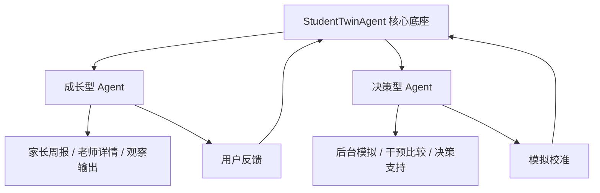

# 成长型与决策型 Agent 关系

> 文档编号：TWIN-012
> 版本：V1.0
> 创建日期：2024
> 最后更新：待定
> 维护人：学生数字孪生负责人

---

## 1. 文档目的

本文档用于定义教育孪生项目中“成长型 Agent”与“决策型 Agent”的定位、边界、关系与协作方式。

---

## 2. 基本判断

StudentTwinAgent 是学生个体的核心底座。
在其之上，后续可分化出两类能力形态：

1. 成长型 Agent
2. 决策型 Agent

这两者不是两个互相独立的新系统，而是共享同一个学生孪生底座的两种工作形态。

---

## 3. 成长型 Agent 定义

成长型 Agent 主要面向：

- 当前状态观察
- 变化解释
- 周报/月报输出
- 低风险提醒
- 学习过程支持

它更关注：

- 看懂现在
- 解释变化
- 持续陪伴
- 低风险、高频、日常使用

---

## 4. 决策型 Agent 定义

决策型 Agent 主要面向：

- 干预动作比较
- 后台影子推演
- 风险变化模拟
- 选科、志愿等受控决策支持

它更关注：

- 比较方案
- 评估动作
- 模拟后果
- 高风险、低频、强约束使用

---

## 5. 两者的共同底座

两者共享：

- 学生基础身份层
- 事实状态层
- 行为执行层
- 时间演化层
- 关系上下文层
- 推演准备层
- 图谱与时序记忆

也就是说，它们不是两套不同学生模型，而是同一 StudentTwinAgent 的两种上层使用方式。

---

## 6. 两者的主要差异

### 成长型 Agent

- 面向家长和老师
- 输出偏观察、解释、提醒
- 高可理解性
- 低风险
- 高频触达

### 决策型 Agent

- 面向后台、专业角色或受控场景
- 输出偏比较、模拟、建议
- 高约束
- 高风险
- 低频触达

---

## 7. 协作关系建议

---

## 8. 成长型 Agent 的价值

成长型 Agent 的核心价值是：

- 帮助理解学生当前状态
- 降低家长和老师的认知成本
- 把碎片信息变成连续观察
- 为后续决策打地基

如果没有成长型 Agent，决策型 Agent 往往会失去可信的日常语境。

---

## 9. 决策型 Agent 的价值

决策型 Agent 的核心价值是：

- 帮助比较不同动作
- 帮助识别更值得尝试的方案
- 帮助后台构建更成熟的干预逻辑
- 为高风险场景提供受控支持

如果没有决策型 Agent，系统就容易停留在“会观察，但不会比较动作”的阶段。

---

## 10. 当前阶段建议

当前项目更应优先建设成长型 Agent 主线，并逐步搭建决策型 Agent 的后台能力。

原因：

1. 观察层是低风险高频价值入口
2. 成长型输出更容易在试点中建立信任
3. 决策型能力更依赖时序记忆、动作库和校准机制
4. 高风险能力不宜过早前台化

---

## 11. 结论

成长型 Agent 和决策型 Agent 的关系，不是二选一，而是先后成熟、共享底座、分层输出的关系。

最合理的路径是：

- 先把成长型 Agent 做稳
- 再让决策型 Agent 在后台逐步成熟
- 最后在明确边界下开放部分受控能力

这样 StudentTwinAgent 才不会一开始就被推到高风险决策前台，而是先在真实教育场景中长出可信度。

## 与其他文档的关系

| 文档 | 关联文档 | 关系说明 |
|------|----------|----------|
| TWIN-012 成长型与决策型 Agent 关系 | TWIN-001 StudentTwinAgent 总体设计 | 本文档是总体设计的 Agent 类型关系展开 |
| TWIN-012 成长型与决策型 Agent 关系 | TWIN-011 Agent 生命周期管理 | Agent 类型关系影响生命周期设计 |
| TWIN-012 成长型与决策型 Agent 关系 | SIM-008 成长型 Agent 设计 | 成长型 Agent 设计遵循本文档定义 |
| TWIN-012 成长型与决策型 Agent 关系 | SIM-009 决策型 Agent 设计 | 决策型 Agent 设计遵循本文档定义 |
