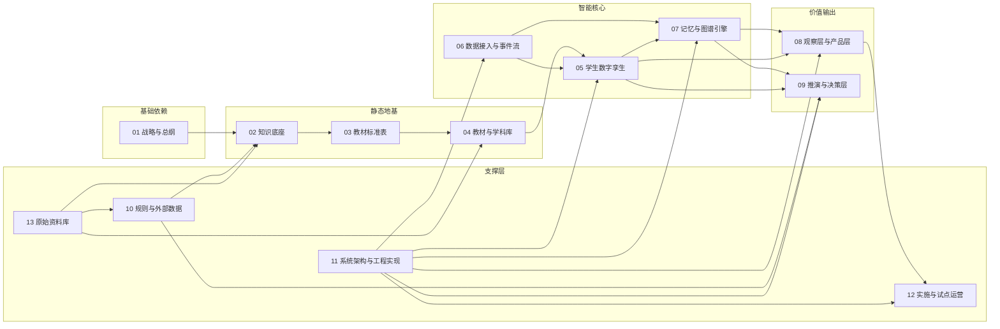
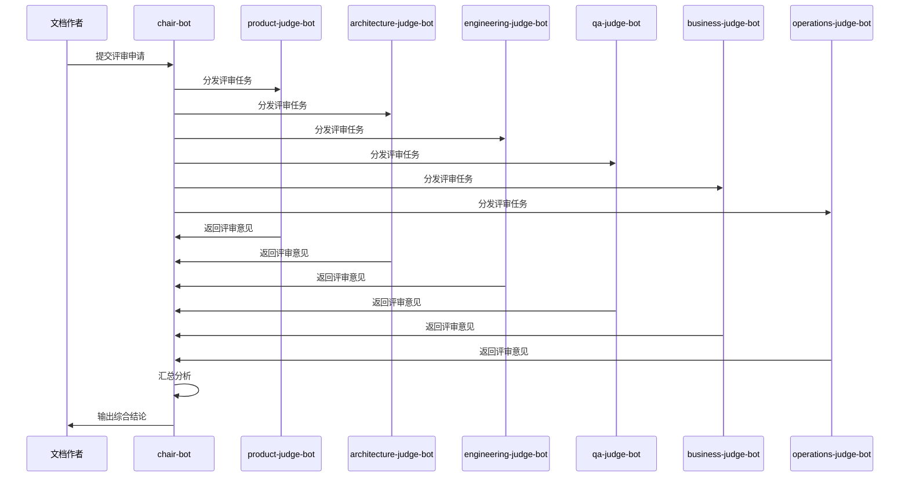

# 教育孪生项目 - Claude 项目级记忆文件

> 文档编号：CLAUDE-001  
> 版本：V1.0  
> 创建日期：2024  
> 最后更新：待定  
> 维护人：项目负责人

---

## 1. 项目目标与范围

### 1.1 项目核心定位

教育孪生项目（产品名：课课）是一个围绕学生长期成长过程构建的教育智能系统。

**核心智能体**：StudentTwinAgent（学生数字孪生智能体）

**一句话定位**：
以教材与地区规则为固定知识底座，以多源学习事件为持续输入，以学生数字孪生和图谱记忆为核心引擎，以观察、解释、干预和推演为主要输出能力。

### 1.2 项目要解决的核心问题

1. **学生状态碎片化**：作业、考试、课堂反馈等信息分散，无法形成连续表达
2. **缺乏统一观察框架**：家长、老师、学校各看各的局部，缺少共同语言
3. **现有教育 AI 停留在工具层**：不能持续建模学生状态
4. **教育环境强地区差异**：教材版本、考试规则、升学制度差异明显

### 1.3 核心目标用户

- **家长**：持续理解孩子学习过程变化
- **老师**：快速定位问题、识别重点学生、理解班级共性问题
- **学校/教育机构管理者**：查看试点运行、班级差异、问题聚集区
- **项目运营与实施方**：持续发现问题、修正问题、沉淀方法

### 1.4 项目边界

**本项目是**：
- 围绕学生长期状态构建的智能系统
- 结构化中台（处理知识底座、输入事件、状态更新、图谱记忆、观察输出）
- 有教育边界的 AI（以地区规则、教材体系、学校场景为边界）

**本项目不是**：
- 纯聊天机器人
- 传统题库系统
- 标准教务 ERP
- 学习机硬件项目
- 高风险自动决策系统

### 1.5 项目方法论

```text
先建立固定知识底座
    ↓
再统一多源学习事件
    ↓
再建立 StudentTwinAgent
    ↓
再沉淀图谱记忆与时序记忆
    ↓
再输出观察与解释
    ↓
最后逐步开放推演与决策支持
```

---

## 2. 文档目录结构说明

### 2.1 一级目录总览

| 目录编号 | 目录名称 | 核心作用 | 一句话定义 |
|----------|----------|----------|------------|
| 01 | 战略与总纲 | 定方向 | 项目是什么、为什么做、阶段目标 |
| 02 | 知识底座 | 定世界 | 教材知识点的标准化存储结构 |
| 03 | 教材标准表 | 定规范 | 章节树/知识点/能力点的表结构标准 |
| 04 | 教材与学科库 | 定内容 | 具体学科的结构化知识地图 |
| 05 | 学生数字孪生 | 定个体 | 每个学生的 StudentTwinAgent 设计 |
| 06 | 数据接入与事件流 | 定输入 | 微信/钉钉/扫描仪的数据输入规范 |
| 07 | 记忆与图谱引擎 | 定上下文 | 图谱记忆、GraphRAG、时序记录 |
| 08 | 观察层与产品层 | 定输出 | 家长端/老师端/学校端的展示规则 |
| 09 | 推演与决策层 | 定未来 | 干预推演、风险预测、志愿填报 |
| 10 | 规则与外部数据 | 定约束 | 地区规则、高考数据、政策口径 |
| 11 | 系统架构与工程实现 | 定落地 | 技术架构、API、部署运维 |
| 12 | 实施与试点运营 | 定交付 | 学校接入、试点实施、反馈闭环 |
| 13 | 原始资料库 | 定证据 | 教材 PDF、政策资料、历史版本 |

### 2.2 文档依赖关系



### 2.3 层级结构说明

- **战略层**（01）：定方向，所有文档的上游
- **知识层**（02-04）：静态地基，提供固定知识底座
- **核心层**（05-07）：智能核心，学生孪生+数据接入+图谱引擎
- **产品层**（08-09）：价值输出，观察层+推演层
- **工程层**（10-11）：外部约束与工程落地
- **运营层**（12）：交付运营
- **资料层**（13）：原始资料与证据

---

## 3. 文档编号与引用规则

### 3.1 模块编号前缀总表

| 模块 | 目录 | 编号前缀 |
|------|------|----------|
| 导航与管理 | `根目录（00_*）` | `NAV` |
| 战略与总纲 | `01_战略与总纲` | `STR` |
| 知识底座 | `02_知识底座` | `KB` |
| 教材标准表 | `03_教材标准表` | `STD` |
| 教材与学科库 | `04_教材与学科库` | `MAT` |
| 学生数字孪生 | `05_学生数字孪生` | `TWIN` |
| 数据接入与事件流 | `06_数据接入与事件流` | `INGEST` |
| 记忆与图谱引擎 | `07_记忆与图谱引擎` | `GRAPH` |
| 观察层与产品层 | `08_观察层与产品层` | `OBS` |
| 推演与决策层 | `09_推演与决策层` | `SIM` |
| 规则与外部数据 | `10_规则与外部数据` | `RULE` |
| 系统架构与工程实现 | `11_系统架构与工程实现` | `ARCH` |
| 实施与试点运营 | `12_实施与试点运营` | `OPS` |
| 原始资料库 | `13_原始资料库` | `RAW` |

### 3.2 编号格式

**基础格式**：`模块前缀-三位序号`

示例：
- `STR-002` = 战略类第 2 号文档
- `TWIN-001` = 学生孪生类第 1 号文档
- `MAT-PHY-001` = 教材库 - 物理学科第 1 号文档

### 3.3 引用规则

**正确示例**：
- 详见 `TWIN-003 学生状态模型`
- 本文档与 `GRAPH-006 上下文装配规则` 强相关
- 本流程依赖 `INGEST-007 学习事件生成标准`

**引用格式**：
```text
`编号 文档名`
```

**要求**：
- 编号与标题之间保留一个空格
- 标题应与正式文档标题一致
- 优先使用文档编号 + 文档标题

### 3.4 文档状态定义

| 状态 | 定义 | 可被引用 | 可评审 |
|------|------|----------|--------|
| 未开始 | 尚未创建 | ❌ | ❌ |
| 草稿中 | 正在编写，内容不完整 | ❌ | ❌ |
| 可评审 | 内容完整，等待评审 | ✅ | ✅ |
| 已冻结 | 评审通过，版本锁定 | ✅ | ❌ |
| 已归档 | 历史版本，被新版替代 | ❌ | ❌ |

---

## 4. 本项目的文档评审机制

### 4.1 评审流程

```text
文档编写完成
    ↓
作者提交评审申请
    ↓
chair-bot 分发给 6 个评委
    ↓
6 个评委并行评审
    ↓
chair-bot 收集并汇总评审意见
    ↓
综合结论
    ↓
（如需修改）作者修改后再次提交
    ↓
（如通过）文档状态更新为"已冻结"
```

### 4.2 评审触发条件

文档进入评审需要满足以下条件：
1. 文档状态为"可评审"
2. 文档内容完整（非草稿）
3. 文档头部元信息完整（编号、版本、创建日期、维护人）
4. 文档末尾有"与其他文档的关系"表

### 4.3 评审周期

- 常规评审：提交后 3 个工作日内完成
- 紧急评审：提交后 1 个工作日内完成
- 重大文档评审：提交后 5 个工作日内完成

---

## 5. "6 个评委 + 1 个主持汇总员"角色协作规则

### 5.1 角色定义

| 角色 | 文件名 | 职责 | 评审视角 |
|------|--------|------|----------|
| 主持汇总员 | chair-bot.md | 主持、分发、收集、汇总，不参与评判 | 无 |
| 产品评委 | product-judge-bot.md | 从产品与需求视角评审 | 产品视角 |
| 架构评委 | architecture-judge-bot.md | 从系统架构视角评审 | 架构视角 |
| 工程评委 | engineering-judge-bot.md | 从开发实现视角评审 | 工程视角 |
| 测试评委 | qa-judge-bot.md | 从测试验收视角评审 | 测试视角 |
| 业务评委 | business-judge-bot.md | 从业务/教研视角评审 | 业务视角 |
| 运营评委 | operations-judge-bot.md | 从实施/运营/试点落地视角评审 | 运营视角 |

### 5.2 协作流程



### 5.3 角色分工原则

1. **chair-bot**：
   - 不参与评判，只负责流程管理
   - 分发评审任务给 6 个评委
   - 收集所有评委意见
   - 汇总并输出综合结论
   - 跟踪修改后的复核流程

2. **6 个评委**：
   - 只从本角色视角发言
   - 不得越权替其他角色下结论
   - 必须按照统一格式输出评审意见
   - 结论只能是三种之一：通过、补充后复核、不通过

---

## 6. 正式评审的统一结论枚举

### 6.1 三种结论

| 结论 | 含义 | 后续动作 |
|------|------|----------|
| **通过** | 文档质量符合要求，可以冻结 | 文档状态更新为"已冻结" |
| **补充后复核** | 文档基本合格，但需要补充或修改部分内容 | 作者修改后，再次提交评审 |
| **不通过** | 文档存在重大问题，需要重新编写 | 作者重新编写后，再次提交评审 |

### 6.2 结论判定标准

**通过**：
- 核心功能定义清晰
- 功能完整度达标
- 可进入下一阶段
- 无重大遗漏或错误

**补充后复核**：
- 核心功能基本清晰，但需要补充细节
- 功能完整度基本达标，但需要完善
- 需要小幅修改即可进入下一阶段
- 有少量遗漏或错误，但影响不大

**不通过**：
- 核心功能定义不清晰
- 功能完整度严重不足
- 无法进入下一阶段
- 存在重大遗漏或错误

### 6.3 综合结论生成规则

chair-bot 根据以下规则生成综合结论：

1. **全票通过** → 综合结论：通过
2. **多数通过（≥4 票）** → 综合结论：通过，但需关注少数派意见
3. **多数补充后复核（≥4 票）** → 综合结论：补充后复核
4. **任何一票不通过** → 综合结论：补充后复核（如只有 1 票不通过）或不通过（如≥2 票不通过）
5. **其他情况** → chair-bot 根据具体情况综合判断

---

## 7. 文档修改原则

### 7.1 总纲不展开到实现细节

**原则**：总纲类文档（如 STR-002 项目需求总纲）应保持高层抽象，不展开到具体实现细节。

**示例**：
- ✅ 正确：系统应支持多源学习事件输入
- ❌ 错误：系统应使用 Kafka 接收微信消息，消息格式为 JSON，字段包括...

**原因**：总纲类文档的核心作用是定方向、定边界，过早陷入实现细节会：
- 限制后续架构设计的灵活性
- 增加文档维护成本
- 导致文档层级混乱

### 7.2 下位文档承接细化

**原则**：每个层级的文档应只关注本层级的问题，具体细化由下位文档承接。

**层级关系**：
```text
01_战略与总纲（STR）
    ↓ 细化
11_系统架构与工程实现（ARCH）
    ↓ 细化
具体模块设计文档（如 TWIN、GRAPH）
    ↓ 细化
代码实现
```

**示例**：
- STR-002 项目需求总纲：定义"系统应支持学生学习状态建模"
- ARCH-001 总体技术架构：定义"使用 StudentTwinAgent 架构"
- TWIN-001 StudentTwinAgent 总体设计：定义"Agent 包含状态层、行为层、演化层"
- TWIN-003 学生状态模型：定义"状态层包含知识掌握度、能力成长值、学习习惯"

### 7.3 所有修改必须服务于开发拆解、架构映射、测试验收和落地场景

**原则**：任何文档修改都必须能够回答以下问题：
1. 这个修改如何帮助开发人员拆解任务？
2. 这个修改如何映射到系统架构？
3. 这个修改如何指导测试验收？
4. 这个修改如何在实际场景中落地？

**检查清单**：
- [ ] 开发拆解：修改后的文档能否让开发人员明确知道要做什么？
- [ ] 架构映射：修改后的文档能否明确对应到系统架构的某个模块？
- [ ] 测试验收：修改后的文档能否生成明确的测试用例和验收标准？
- [ ] 落地场景：修改后的文档能否在实际教育场景中执行？

**反例**：
- ❌ "系统应该很智能" → 无法拆解、无法映射、无法测试、无法落地
- ✅ "系统应能根据学生的作业完成情况，自动更新知识掌握度，误差范围 ±10%" → 可拆解、可映射、可测试、可落地

---

## 8. Claude 在本项目中的工作边界

### 8.1 优先读取项目现有文档

**原则**：Claude 在回答问题或修改文档前，必须优先读取项目现有文档，而不是凭空生成内容。

**执行流程**：
```text
接收用户请求
    ↓
判断是否涉及项目现有内容
    ↓ （是）
先读取相关文档（使用 find_path、read_file 工具）
    ↓
基于现有文档内容进行回答或修改
    ↓
确保与现有文档保持一致
```

**示例**：
- 用户问："学生数字孪生包含哪些层？"
- ✅ 正确做法：先读取 `05_学生数字孪生/01_StudentTwinAgent总体设计.md`，然后回答
- ❌ 错误做法：直接根据通用知识回答，可能遗漏项目特有的层

### 8.2 不得凭空发明不存在的模块和术语

**原则**：Claude 不得发明项目中不存在的模块、术语、概念或功能。

**禁止事项**：
1. 发明新的模块名称（如"智能推荐引擎"，如果项目中没有这个模块）
2. 发明新的术语（如"学习路径规划"，如果项目文档中没有定义）
3. 发明新的功能（如"自动生成习题"，如果项目需求中没有）
4. 发明新的角色（如"学生端 App"，如果项目中只有家长端和老师端）

**正确做法**：
- 如果用户问到的内容在项目中不存在，应明确说明"根据项目现有文档，没有找到 XXX 的定义"
- 如果用户要求新增内容，应先确认是否符合项目定位和范围

### 8.3 修改时必须保持文档编号、路径、层级结构一致

**原则**：修改文档时，必须保持文档的编号、文件路径、层级结构不变。

**不变项**：
1. **文档编号**：如 `STR-002` 不能改为 `STR-003`
2. **文件路径**：如 `01_战略与总纲/02_项目需求总纲.md` 不能移动到其他目录
3. **文件命名**：如 `02_项目需求总纲.md` 不能改为 `02_项目需求.md`
4. **层级结构**：如一级标题、二级标题的层级关系不能随意调整

**可变项**：
1. 文档内容（正文）
2. 文档版本号（在元信息中更新）
3. 文档标题（如果确实需要，但要谨慎）
4. 最后更新时间、维护人等元信息

**修改流程**：
```text
接收修改请求
    ↓
读取原文档
    ↓
识别需要修改的内容
    ↓
保持编号、路径、层级不变
    ↓
修改正文内容
    ↓
更新元信息（版本号、最后更新时间）
    ↓
确保引用关系不被破坏
```

### 8.4 Claude 的工作边界总结

| 允许 | 禁止 |
|------|------|
| ✅ 读取现有文档并基于其内容回答 | ❌ 凭空生成与项目不符的内容 |
| ✅ 修改文档正文内容 | ❌ 修改文档编号、路径、层级 |
| ✅ 更新文档元信息（版本、时间） | ❌ 发明不存在的模块和术语 |
| ✅ 补充缺失的文档内容 | ❌ 破坏文档间的引用关系 |
| ✅ 基于项目规范创建新文档 | ❌ 创建与项目定位不符的文档 |

---

## 9. 项目核心术语统一口径

| 名称类型 | 统一名称 | 备注 |
|----------|----------|------|
| 总项目名 | 教育孪生项目 | 内部项目代号 |
| 产品名 | 课课 | 对外产品名称 |
| 核心智能体 | StudentTwinAgent | 学生数字孪生智能体 |
| 前台层 | 前台观察层 | 面向用户的产品展示层 |
| 后台层 | 后台推演层 | 干预建议与决策模拟层 |
| 底层地图 | 固定知识底座 | 教材知识点的标准化存储结构 |
| 图谱引擎 | 记忆与图谱引擎 | 包含 GraphRAG、时序记忆 |
| 数据输入 | 数据接入与事件流 | 微信/钉钉/扫描仪等输入渠道 |

---

## 10. Claude 在评审流程中的角色

### 10.1 评审触发

当用户请求评审文档时，Claude 应：
1. 确认文档状态为"可评审"
2. 确认文档满足评审条件
3. 启动 chair-bot

### 10.2 Claude 作为 chair-bot

Claude 可以扮演 chair-bot 角色，执行以下任务：
1. 分发评审任务给 6 个评委（可以是 Claude 扮演的不同角色）
2. 收集 6 个评委的评审意见
3. 汇总分析并输出综合结论

### 10.3 Claude 作为评委

Claude 可以扮演 6 个评委角色，每个角色：
1. 只从本角色视角发言
2. 不越权替其他角色下结论
3. 按照统一格式输出评审意见
4. 结论只能是：通过、补充后复核、不通过

---

## 11. 文件树结构

```
AEdu/
├── CLAUDE.md                          # 本文件（项目级记忆）
├── .claude/
│   └── agents/
│       ├── chair-bot.md               # 主持汇总员
│       ├── product-judge-bot.md       # 产品评委
│       ├── architecture-judge-bot.md  # 架构评委
│       ├── engineering-judge-bot.md   # 工程评委
│       ├── qa-judge-bot.md            # 测试评委
│       ├── business-judge-bot.md      # 业务评委
│       └── operations-judge-bot.md    # 运营评委
├── 00_全库编号与引用统一规范.md
├── 00_项目文档导航总图.md
├── 00_文档状态总表.md
├── 01_战略与总纲/
│   ├── 01_项目定位.md
│   ├── 02_项目需求总纲.md
│   └── ...
├── 02_知识底座/
│   ├── 01_固定知识底座设计框架.md
│   └── ...
├── 03_教材标准表/
│   ├── 01_章节树表标准.md
│   └── ...
├── 04_教材与学科库/
│   ├── 学科建设优先级规划.md
│   └── ...
├── 05_学生数字孪生/
│   ├── 01_StudentTwinAgent总体设计.md
│   └── ...
├── 06_数据接入与事件流/
│   ├── 01_微信钉钉接入标准.md
│   └── ...
├── 07_记忆与图谱引擎/
│   └── ...
├── 08_观察层与产品层/
│   └── ...
├── 09_推演与决策层/
│   └── ...
├── 10_规则与外部数据/
│   └── ...
├── 11_系统架构与工程实现/
│   └── ...
├── 12_实施与试点运营/
│   └── ...
└── 13_原始资料库/
    └── ...
```

---

## 12. 与其他文档的关系

| 本文档 | 关联文档 | 关系说明 |
|--------|----------|----------|
| CLAUDE-001 项目记忆文件 | NAV-004 全库编号与引用统一规范 | 本文件引用编号规范 |
| CLAUDE-001 项目记忆文件 | NAV-001 项目文档导航总图 | 本文件引用目录结构 |
| CLAUDE-001 项目记忆文件 | STR-001 项目定位 | 本文件引用项目定位 |
| CLAUDE-001 项目记忆文件 | .claude/agents/* | 本文件定义了 7 个 agent 的协作规则 |

---

## 13. 维护说明

- **维护人**：项目负责人
- **更新频率**：当项目结构、编号规则、评审机制发生变化时更新
- **版本管理**：每次更新后递增版本号
- **评审要求**：重大变更需要通过 6 个评委评审

---

**文档状态**：草稿中  
**审批人**：待定  
**下次评审日期**：待定