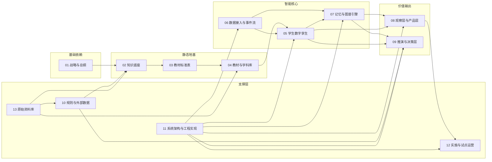

# 教育孪生项目

> 项目代号：AEdu  
> 产品名称：课课  
> 核心智能体：StudentTwinAgent  
> 文档版本：V1.0  
> 最后更新：2024

---

## 一、项目简介

**教育孪生项目**是一个以学生为中心、以教材与地区规则为底座、以多源学习事件为输入、以图谱记忆和推演机制为核心、以观察与干预决策支持为输出的教育智能系统。

**核心一句话定位**：为每一个学生建立可持续更新、可解释、可推演的数字孪生体。

---

## 二、核心目标

| 目标 | 说明 |
|------|------|
| 建立固定知识底座 | 教材、知识点、能力点、地区规则的标准化存储结构 |
| 构建学生数字孪生 | 为每个学生创建 StudentTwinAgent，持续追踪学习状态与成长轨迹 |
| 打通多源输入 | 支持微信、钉钉、学校扫描仪等多渠道数据输入 |
| 建立图谱记忆与推演能力 | 基于 GraphRAG 构建学生时序记忆与知识图谱，支持干预推演 |
| 提供观察与决策支持 | 前台可观察、后台可推演，面向家长/老师/学校提供价值输出 |

---

## 三、项目整体结构

```
教育孪生项目/
│
├── 01_战略与总纲          # 项目定位、需求总纲、路线图、商业模式
├── 02_知识底座            # 固定知识底座设计框架、地区层、入库标准
├── 03_教材标准表          # 章节树/知识点/能力点等标准表规范
├── 04_教材与学科库        # 高中物理/数学/语文/英语等学科库
├── 05_学生数字孪生        # StudentTwinAgent 总体设计与字段规范
├── 06_数据接入与事件流    # 微信/钉钉/扫描仪接入与事件生成标准
├── 07_记忆与图谱引擎      # 图谱记忆层、GraphRAG 检索设计
├── 08_观察层与产品层      # 家长端/老师端/学校端展示规则
├── 09_推演与决策层        # 干预模拟、风险预测、志愿填报推演
├── 10_规则与外部数据      # 地区考试规则、高考历史数据、政策口径
├── 11_系统架构与工程实现  # 技术架构、服务拆分、部署运维
├── 12_实施与试点运营      # 学校接入、试点实施、培训与反馈
└── 13_原始资料库          # 教材 PDF、政策资料、历史版本归档
```

---

## 四、当前优先建设范围（MVP）

### 4.1 学科范围
优先从**高中物理**启动，后续扩展至高中数学、英语、语文。

### 4.2 核心模块
| 模块 | 范围 |
|------|------|
| 知识底座 | 高中物理必修一章节树、知识点表、能力点表、教材锚点表 |
| 学生孪生 | StudentTwinAgent 基础版（基础身份、事实状态、行为事件层） |
| 数据接入 | 家长微信文本输入、学校扫描件 OCR 输入、基础手工录入 |
| 图谱记忆 | 学生事实记忆、学习事件关联、基础 GraphRAG 检索 |
| 产品输出 | 家长端基础观察页面、学生周报、风险提示 |

### 4.3 优先文档清单
以下文档为 P0 优先级，需立即启动编写：

| 优先级 | 文档路径 | 文档编号 | 状态 |
|--------|----------|----------|------|
| P0-1 | `01_战略与总纲/02_项目需求总纲.md` | STR-002 | 草稿中 |
| P0-2 | `02_知识底座/01_固定知识底座设计框架.md` | KB-001 | 未开始 |
| P0-3 | `05_学生数字孪生/01_StudentTwinAgent 总体设计.md` | TWIN-001 | 未开始 |
| P0-4 | `11_系统架构与工程实现/01_总体技术架构.md` | ARCH-001 | 未开始 |

---

## 五、当前最小启动路径

### 5.1 第一步：地基文档（本周完成）
1. `01_战略与总纲/02_项目需求总纲.md` - 明确项目边界与目标
2. `02_知识底座/01_固定知识底座设计框架.md` - 明确底座分层与原则
3. `02_知识底座/04_教材首轮入库标准.md` - 明确入库流程与质量

### 5.2 第二步：核心设计（下周完成）
4. `03_教材标准表/01_章节树表标准.md` - 章节结构规范
5. `03_教材标准表/02_知识点表标准.md` - 知识点提取规范
6. `05_学生数字孪生/01_StudentTwinAgent 总体设计.md` - 学生模型设计
7. `07_记忆与图谱引擎/01_图谱记忆层设计.md` - 图谱建模设计

### 5.3 第三步：内容填充（第三周完成）
8. `04_教材与学科库/高中物理/章节树/高中物理必修一知识树_V1.md` - 首个学科知识树
9. `06_数据接入与事件流/07_学习事件生成标准.md` - 事件标准化规范
10. `11_系统架构与工程实现/01_总体技术架构.md` - 技术架构设计

---

## 六、统一命名口径

| 名称类型 | 统一名称 | 说明 |
|----------|----------|------|
| 总项目名 | 教育孪生项目 | 内部项目代号 |
| 产品名 | 课课 | 对外产品名称 |
| 核心智能体 | StudentTwinAgent | 学生数字孪生智能体 |
| 前台层 | 前台观察层 | 面向用户的产品展示层 |
| 后台层 | 后台推演层 | 干预建议与决策模拟层 |
| 底层地图 | 固定知识底座 | 教材知识点的标准化存储结构 |
| 图谱引擎 | 记忆与图谱引擎 | 包含 GraphRAG、时序记忆 |

---

## 七、文档维护原则

### 7.1 编写顺序
- 先总纲，后细则
- 先标准，后内容
- 先试点可跑，后全面扩张

### 7.2 版本管理
- 所有核心文档需版本化（V1.0、V1.1、V2.0）
- 版本变更需记录变更人、变更内容、影响范围
- 重大变更需评审后发布

### 7.3 文档状态
| 状态 | 定义 |
|------|------|
| 未开始 | 尚未创建 |
| 草稿中 | 正在编写，内容不完整 |
| 可评审 | 内容完整，等待评审 |
| 已冻结 | 评审通过，版本锁定 |
| 已归档 | 历史版本，被新版替代 |

### 7.4 文档编号规则
采用 `[类别前缀]-[三位序号]` 格式：
- `STR-002` = 战略类第 2 号文档
- `KB-001` = 知识底座类第 1 号文档
- `TWIN-001` = 学生孪生类第 1 号文档
- `ARCH-001` = 架构类第 1 号文档

详细前缀表参见 [`00_项目文档导航总图.md`](./00_项目文档导航总图.md)

---

## 八、核心逻辑一句话

| 层级 | 核心作用 | 一句话定义 |
|------|----------|------------|
| 01 战略与总纲 | 定方向 | 项目是什么、为什么做、阶段目标 |
| 02 知识底座 | 定世界 | 教材知识点的标准化存储结构 |
| 03 教材标准表 | 定规范 | 章节树/知识点/能力点的表结构标准 |
| 04 教材与学科库 | 定内容 | 具体学科的结构化知识地图 |
| 05 学生数字孪生 | 定个体 | 每个学生的 StudentTwinAgent 设计 |
| 06 数据接入与事件流 | 定输入 | 微信/钉钉/扫描仪的数据输入规范 |
| 07 记忆与图谱引擎 | 定上下文 | 图谱记忆、GraphRAG、时序记录 |
| 08 观察层与产品层 | 定输出 | 家长端/老师端/学校端的展示规则 |
| 09 推演与决策层 | 定未来 | 干预推演、风险预测、志愿填报 |
| 10 规则与外部数据 | 定约束 | 地区规则、高考数据、政策口径 |
| 11 系统架构与工程实现 | 定落地 | 技术架构、API、部署运维 |
| 12 实施与试点运营 | 定交付 | 学校接入、试点实施、反馈闭环 |
| 13 原始资料库 | 定证据 | 教材 PDF、政策资料、历史版本 |

---

## 九、快速入口

| 你需要找 | 直接跳转 |
|----------|----------|
| 项目文档导航总图 | [`00_项目文档导航总图.md`](./00_项目文档导航总图.md) |
| 项目需求总纲 | [`01_战略与总纲/02_项目需求总纲.md`](./01_战略与总纲/02_项目需求总纲.md) |
| 知识底座设计框架 | [`02_知识底座/01_固定知识底座设计框架.md`](./02_知识底座/01_固定知识底座设计框架.md) |
| StudentTwinAgent 设计 | [`05_学生数字孪生/01_StudentTwinAgent 总体设计.md`](./05_学生数字孪生/01_StudentTwinAgent 总体设计.md) |
| 总体技术架构 | [`11_系统架构与工程实现/01_总体技术架构.md`](./11_系统架构与工程实现/01_总体技术架构.md) |

---

## 十、项目依赖关系图



---

## 十一、当前状态

| 目录 | 状态 | 文档进度 |
|------|------|----------|
| 01_战略与总纲 | 🟡 进行中 | 1/9 |
| 02_知识底座 | 🔴 未开始 | 0/9 |
| 03_教材标准表 | 🔴 未开始 | 0/12 |
| 04_教材与学科库 | 🔴 未开始 | 0/∞ |
| 05_学生数字孪生 | 🟡 进行中 | 0/12 |
| 06_数据接入与事件流 | 🔴 未开始 | 0/11 |
| 07_记忆与图谱引擎 | 🔴 未开始 | 0/10 |
| 08_观察层与产品层 | 🔴 未开始 | 0/10 |
| 09_推演与决策层 | 🔴 未开始 | 0/12 |
| 10_规则与外部数据 | 🔴 未开始 | 0/∞ |
| 11_系统架构与工程实现 | 🟡 进行中 | 0/12 |
| 12_实施与试点运营 | 🔴 未开始 | 0/8 |
| 13_原始资料库 | 🔴 未开始 | 0/∞ |

**状态图例**：🟢 已完成 | 🟡 进行中 | 🔴 未开始

---

## 十二、联系与维护

- **项目维护人**：待定
- **文档更新时间**：待定
- **下次评审日期**：待定

---

**说明**：本文档是教育孪生项目的根目录入口，详细文档导航请参见 [`00_项目文档导航总图.md`](./00_项目文档导航总图.md)