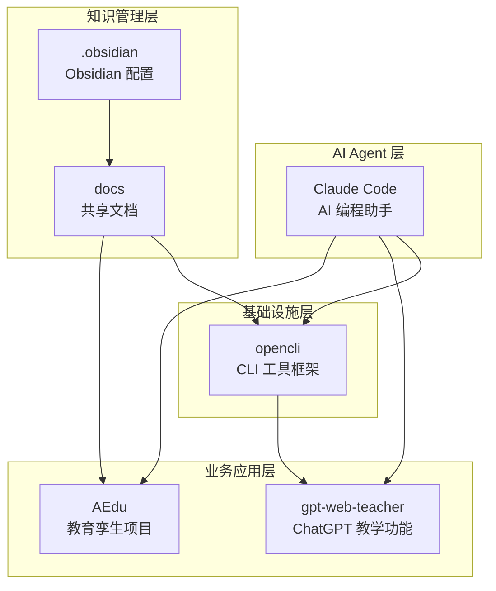
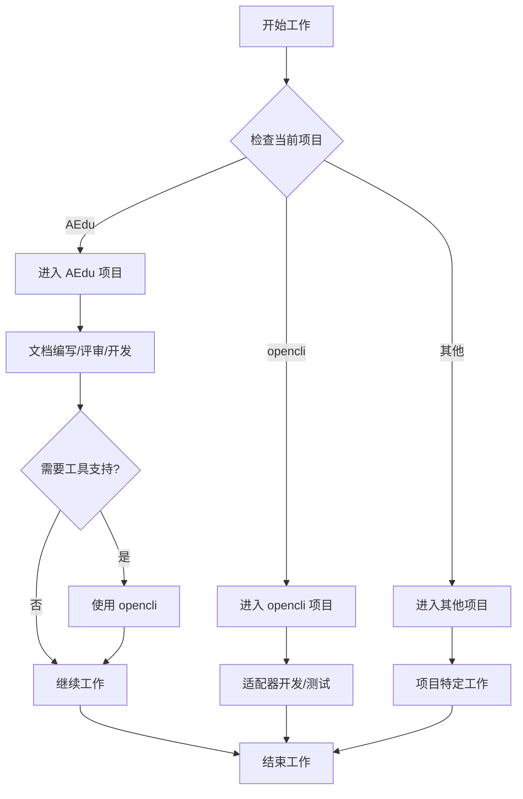
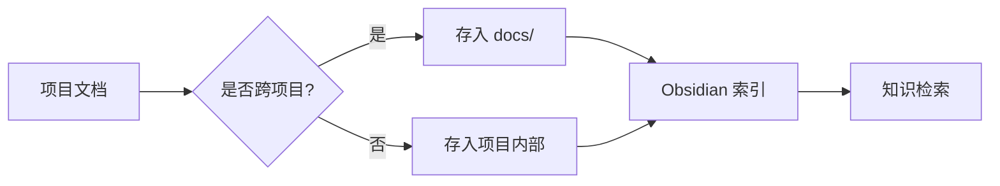
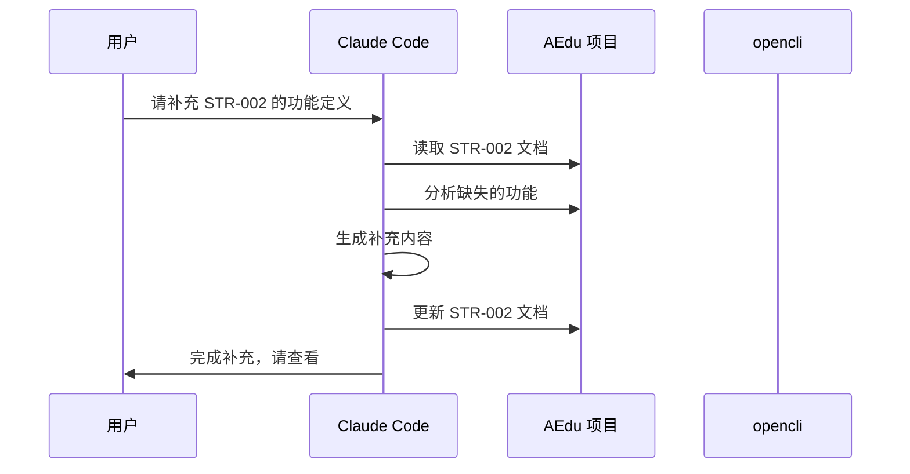
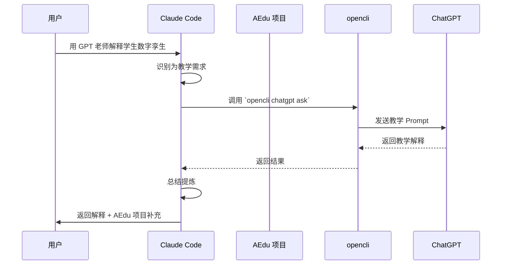
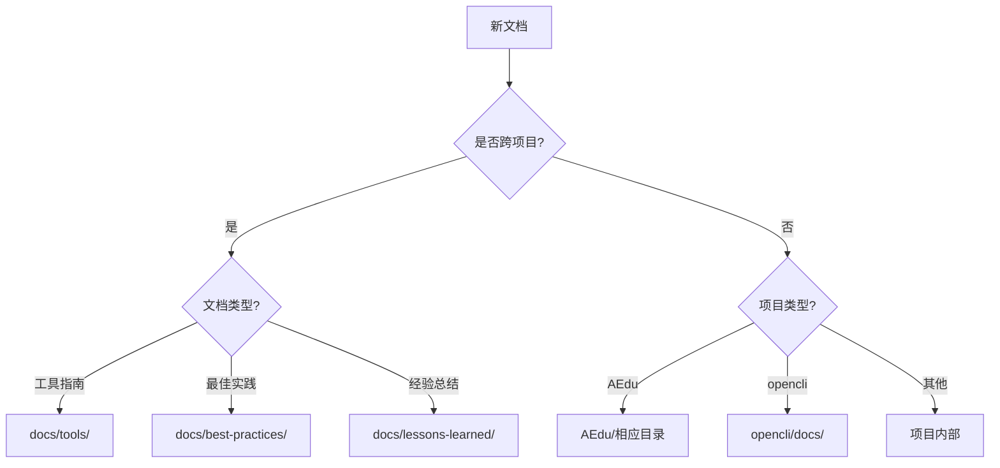

# Workbot 工作空间 - Claude 项目级记忆文件

> 文档编号：WORKBOT-001  
> 版本：V1.0  
> 创建日期：2024  
> 最后更新：待定  
> 维护人：工作空间管理员

---

## 1. 工作空间概述

### 1.1 什么是 workbot

**workbot** 是一个集成化的 AI 工作空间，包含多个子项目和工具，旨在提供完整的 AI 辅助开发、教育和自动化能力。

**核心定位**：
- 🎯 **教育智能化**：通过 AEdu 项目实现教育孪生系统
- 🔧 **工具链整合**：通过 opencli 实现网站和应用的 CLI 化
- 🤖 **AI Agent 协作**：通过 Claude Code 实现 AI 智能辅助
- 📚 **知识管理**：通过 Obsidian 和共享文档实现知识沉淀

### 1.2 工作空间的价值

1. **一站式开发环境**：所有项目和工具集中管理
2. **跨项目协作**：子项目之间可以相互依赖和协作
3. **知识共享**：共享文档、配置和最佳实践
4. **统一版本控制**：整个工作空间使用统一的 Git 仓库

---

## 2. 子项目列表和说明

### 2.1 子项目总览

| 项目名称 | 类型 | 核心功能 | 技术栈 | 状态 |
|---------|------|----------|--------|------|
| **AEdu** | 业务项目 | 教育孪生系统 | 文档驱动 | 🟡 进行中 |
| **opencli** | 基础设施 | CLI 工具框架 | TypeScript, Node.js | 🟢 稳定 |
| **gpt-web-teacher** | 教学工具 | ChatGPT 教学解释 | TypeScript, Node.js | 🟢 稳定 |
| **docs** | 共享文档 | 文档库 | Markdown | 🟢 活跃 |

**状态图例**：
- 🟢 稳定：生产可用，功能完整
- 🟡 进行中：正在开发或测试
- 🔴 未开始：尚未启动

### 2.2 子项目详细说明

#### 2.2.1 AEdu - 教育孪生项目

**产品名**：课课  
**核心智能体**：StudentTwinAgent

**定位**：
围绕学生长期成长过程构建的教育智能系统，以教材与地区规则为固定知识底座，以多源学习事件为持续输入，以学生数字孪生和图谱记忆为核心引擎。

**核心功能**：
1. 学生学习状态建模
2. 多角色观察框架（家长、老师、学校）
3. 智能观察与解释
4. 干预建议与推演

**文档体系**：
- 13 个一级目录（01_战略与总纲 ~ 13_原始资料库）
- 完整的文档编号体系（STR、KB、TWIN、GRAPH、OBS、SIM、RULE、ARCH、OPS、RAW、NAV、STD、MAT、INGEST）
- 6+1 评审机制（6 个评委 + 1 个主持汇总员）

**子项目级配置**：
- `/Users/busiji/workbot/AEdu/CLAUDE.md` - 项目级记忆文件
- `/Users/busiji/workbot/AEdu/.claude/agents/` - 7 个 subagents

**进入方式**：
```bash
cd /Users/busiji/workbot/AEdu
```

---

#### 2.2.2 opencli - CLI 工具框架

**定位**：
把任何网站或 Electron 应用变成命令行工具，复用 Chrome 登录态，零风控，AI 自动发现接口。

**核心能力**：
1. **多站点覆盖**：B站、知乎、小红书、Twitter、Reddit、YouTube 等
2. **桌面应用支持**：Cursor、ChatGPT、Notion、Discord 等
3. **零风控**：复用 Chrome 登录态，无需存储凭证
4. **AI 原生**：自动发现 API，生成适配器

**安装方式**：
```bash
npm install -g @jackwener/opencli
```

**常用命令**：
```bash
opencli list                    # 查看所有命令
opencli bilibili hot --limit 5  # B站热门
opencli zhihu hot -f json       # 知乎热榜（JSON 格式）
opencli chatgpt ask "问题"      # 调用 ChatGPT
```

**作为基础设施**：
- `opencli chatgpt` 子命令依赖 opencli 调用 ChatGPT
- 可用于自动化测试、数据采集、内容管理等场景

**文档**：
- `/Users/busiji/workbot/opencli/README.zh-CN.md` - 中文 README
- `/Users/busiji/workbot/opencli/SKILL.md` - AI Agent 技能定义
- `/Users/busiji/workbot/opencli/CLI-EXPLORER.md` - 适配器开发指南

**进入方式**：
```bash
cd /Users/busiji/workbot/opencli
```

---

#### 2.2.3 opencli - ChatGPT 教学功能

**定位**：
通过 `opencli chatgpt ask` 命令调用 ChatGPT 提供高质量的教学解释，用于概念教学、代码理解、思路 brainstorm。

**触发条件**：
- 用户明确要求教学、解释、讲解
- 用户询问"为什么"、"原理"、"底层机制"
- 用户需要理解复杂概念而非直接实现

**工作流程**：
1. 识别用户意图（教学/解释类需求）
2. 检查前置条件（ChatGPT Desktop App 或 OpenAI API）
3. 构造教学 Prompt
4. 调用 ChatGPT（通过 `opencli chatgpt ask`）
5. 处理输出并总结提炼
6. 提供后续支持（代码实现、追问解答）

**依赖关系**：
- 依赖 opencli 的 `chatgpt ask` 命令
- 需要 ChatGPT Desktop App 或 OpenAI API Key

**使用示例**：
```bash
# 用户说："用 GPT 老师解释一下 React 的 Virtual DOM"
# Claude 会自动调用：
opencli chatgpt ask "用最清晰、通俗的中文教学风格，详细解释 React 的 Virtual DOM 工作原理..." --timeout 60 -f md
```

**文档**：
- `/Users/busiji/workbot/opencli/SKILL.md` - 技能定义

**进入方式**：
```bash
cd /Users/busiji/workbot/opencli
```

---

#### 2.2.5 docs - 共享文档库

**定位**：
工作空间的共享文档库，存放跨项目的文档和资料。

**当前内容**：
- `cli-test.md` - CLI 测试相关文档

**用途**：
- 存放跨项目的文档
- 存放工具使用指南
- 存放最佳实践和经验总结

**进入方式**：
```bash
cd /Users/busiji/workbot/docs
```

---

## 3. 子项目之间的关系

### 3.1 依赖关系图



### 3.2 核心依赖关系

| 依赖方 | 被依赖方 | 依赖类型 | 说明 |
|--------|----------|----------|------|
| opencli | opencli | 强依赖 | 通过 `chatgpt ask` 命令调用 ChatGPT |
| AEdu | Claude Code | 协作 | Claude Code 辅助 AEdu 开发 |
| 所有项目 | docs | 弱依赖 | 共享文档和知识 |
| Claude Code | opencli | 工具使用 | Claude 可以调用 opencli 命令 |

### 3.3 协作场景

#### 场景 1：使用 GPT 老师解释概念

**流程**：
1. 用户在 AEdu 项目中遇到不理解的概念
2. Claude Code 识别为教学需求
3. Claude Code 使用 `opencli chatgpt ask` 调用 ChatGPT
4. ChatGPT 返回教学解释
5. Claude Code 总结提炼并应用到 AEdu 项目

**涉及项目**：AEdu → Claude Code → opencli → ChatGPT

---

#### 场景 2：使用 opencli 自动化数据采集

**流程**：
1. AEdu 项目需要采集教育资源数据
2. Claude Code 编写 opencli 适配器
3. 使用 opencli 自动采集数据
4. 数据存入 AEdu 项目的资料库

**涉及项目**：AEdu → Claude Code → opencli

---

## 4. 总体工作流程

### 4.1 日常工作流程



### 4.2 项目切换流程

#### 从 AEdu 切换到 opencli

```bash
# 当前在 AEdu 项目
cd /Users/busiji/workbot/AEdu

# 切换到 opencli
cd /Users/busiji/workbot/opencli

# 使用 opencli
opencli list
opencli bilibili hot --limit 5

# 返回 AEdu
cd /Users/busiji/workbot/AEdu
```

#### 从任意项目使用 opencli ChatGPT 功能

**不需要切换目录**，Claude Code 会自动识别教学需求并调用 `opencli chatgpt ask` 命令。

### 4.3 知识管理流程



---

## 5. 跨项目的协作规则

### 5.1 Claude Code 的工作边界

#### ✅ 允许的操作

1. **跨项目读取文档**
   - 读取 opencli 的文档以了解工具使用方法
   - 读取 opencli 的 SKILL.md 以了解如何调用 ChatGPT
   - 读取 agents/molt 的配置以借鉴设计

2. **调用其他项目的工具**
   - 调用 opencli 的命令
   - 调用 opencli 的 `chatgpt ask` 命令

3. **在 docs/ 中创建跨项目文档**
   - 创建工具使用指南
   - 创建最佳实践文档
   - 创建经验总结

#### ❌ 禁止的操作

1. **不要修改其他项目的核心代码**
   - 不要修改 opencli 的源代码（除非明确要求）
   - 不要修改 opencli 的 SKILL.md（除非明确要求）
   - 不要修改 agents/molt 的配置（除非明确要求）

2. **不要破坏项目间的依赖关系**
   - 不要删除 opencli 的依赖
   - 不要修改共享文档的格式

3. **不要在项目中创建不存在的依赖**
   - 不要在 AEdu 中引用 opencli 中不存在的命令
   - 不要在 opencli 中引用不存在的 ChatGPT 功能

### 5.2 文档管理规则

#### 跨项目文档的存放位置

| 文档类型 | 存放位置 | 示例 |
|---------|---------|------|
| 工具使用指南 | `docs/tools/` | `docs/tools/opencli-guide.md` |
| 最佳实践 | `docs/best-practices/` | `docs/best-practices/ai-agent-design.md` |
| 经验总结 | `docs/lessons-learned/` | `docs/lessons-learned/project-setup.md` |
| 跨项目协作 | `docs/collaboration/` | `docs/collaboration/aedu-opencli.md` |

#### 项目内部文档的存放位置

| 项目 | 存放位置 | 示例 |
|------|---------|------|
| AEdu | `AEdu/` | `AEdu/01_战略与总纲/01_项目定位.md` |
| opencli | `opencli/docs/` | `opencli/docs/adapter-development.md` |
| opencli | `opencli/` | `opencli/SKILL.md` |
| agents/molt | `agents/molt/workspace/docs/` | `agents/molt/workspace/docs/usage.md` |

### 5.3 依赖管理规则

#### 版本依赖

| 项目 | 依赖项 | 版本要求 | 说明 |
|------|--------|----------|------|
| gpt-web-teacher | opencli | >= 0.7.3 | 通过 opencli 调用 ChatGPT |
| opencli | ChatGPT Desktop App | 最新版 | 或使用 OpenAI API |
| agents/molt | Docker | >= 20.0 | 容器化部署 |
| opencli | Node.js | >= 20.0.0 | 运行环境 |
| opencli | Chrome | 最新版 | 浏览器命令需要 |

#### 依赖检查

**检查 opencli 版本**：
```bash
opencli --version
```

**检查 Node.js 版本**：
```bash
node --version
```

**检查 Docker 版本**：
```bash
docker --version
```

**检查 ChatGPT Desktop App**：
```bash
opencli chatgpt status
```

### 5.4 协作示例

#### 示例 1：在 AEdu 中使用 opencli 采集数据

**需求**：采集 B站 的教育视频数据，用于 AEdu 项目的知识底座建设。

**步骤**：
1. Claude Code 分析需求，确定需要采集的数据类型
2. Claude Code 调用 opencli 命令：
   ```bash
   opencli bilibili search --keyword "高中物理" --limit 50 -f json > /Users/busiji/workbot/AEdu/13_原始资料库/bilibili-physics.json
   ```
3. Claude Code 读取采集的数据
4. Claude Code 根据数据生成知识点表
5. Claude Code 将知识点表存入 AEdu 项目的相应目录

**涉及项目**：AEdu → opencli

---

#### 示例 2：使用 opencli ChatGPT 功能解释 AEdu 中的概念

**需求**：用户不理解 AEdu 项目中的"学生数字孪生"概念。

**步骤**：
1. 用户提问："用 GPT 老师解释一下学生数字孪生是什么"
2. Claude Code 识别为教学需求
3. Claude Code 调用 `opencli chatgpt ask` 命令
4. ChatGPT 返回教学解释
5. Claude Code 总结提炼，并结合 AEdu 项目的实际情况补充说明
6. Claude Code 返回给用户

**涉及项目**：AEdu → Claude Code → opencli → ChatGPT

---

#### 示例 3：借鉴 agents/molt 的设计到 AEdu

**需求**：AEdu 项目需要设计 Agent 系统，想借鉴 agents/molt 的设计。

**步骤**：
1. Claude Code 读取 agents/molt 的配置文件：
   - `agents/molt/workspace/SOUL.md`（人格定义）
   - `agents/molt/workspace/TOOLS.md`（工具定义）
   - `agents/molt/workspace/MEMORY.md`（记忆机制）
2. Claude Code 分析这些设计的特点
3. Claude Code 结合 AEdu 项目的需求，设计适合教育场景的 Agent 系统
4. Claude Code 生成设计文档，存入 AEdu 项目的相应目录

**涉及项目**：agents/molt → Claude Code → AEdu

---

## 6. 共享资源和配置

### 6.1 Git 仓库

**仓库位置**：`/Users/busiji/workbot/.git`

**管理范围**：整个 workbot 工作空间

**分支策略**：
- `main`：主分支，稳定版本
- `develop`：开发分支，日常开发
- `feature/*`：功能分支，新功能开发

**提交规范**：
```
<type>(<scope>): <subject>

<body>

<footer>
```

**type 类型**：
- `feat`：新功能
- `fix`：修复 bug
- `docs`：文档更新
- `style`：代码格式调整
- `refactor`：重构
- `test`：测试相关
- `chore`：构建/工具相关

**示例**：
```
feat(aedu): 添加学生状态建模文档

- 添加 TWIN-003 学生状态模型文档
- 定义核心状态字段
- 补充状态更新流程

Closes #123
```

### 6.2 Obsidian 配置

**配置位置**：`/Users/busiji/workbot/.obsidian/`

**用途**：
- 使用 Obsidian 管理工作空间的 Markdown 文档
- 支持双向链接、图谱视图、标签管理
- 便于知识管理和检索

**推荐插件**：
- **Templater**：模板管理
- **Dataview**：数据查询
- **Graph Analysis**：图谱分析
- **Advanced Tables**：表格增强

**使用方式**：
1. 用 Obsidian 打开 `/Users/busiji/workbot` 目录
2. 所有 Markdown 文档自动被 Obsidian 索引
3. 使用双向链接 `[[]]` 连接相关文档
4. 使用标签 `#tag` 分类文档

### 6.3 共享文档

**文档位置**：`/Users/busiji/workbot/docs/`

**当前内容**：
- `cli-test.md` - CLI 测试相关文档

**规划目录结构**：
```
docs/
├── tools/                    # 工具使用指南
│   ├── opencli-guide.md
│   └── obsidian-guide.md
├── best-practices/           # 最佳实践
│   ├── ai-agent-design.md
│   └── documentation.md
├── lessons-learned/          # 经验总结
│   └── project-setup.md
├── collaboration/            # 跨项目协作
│   └── aedu-opencli.md
└── cli-test.md              # 现有文档
```

### 6.4 环境变量

**推荐的环境变量配置**：

```bash
# opencli 相关
export OPENCLI_DAEMON_PORT=19825
export OPENCLI_BROWSER_CONNECT_TIMEOUT=30
export OPENCLI_BROWSER_COMMAND_TIMEOUT=45
export OPENCLI_BROWSER_EXPLORE_TIMEOUT=120

# OpenAI API（opencli 备选方案）
export OPENAI_API_KEY="your-api-key"

# workbot 工作空间
export WORKBOT_ROOT="/Users/busiji/workbot"
export WORKBOT_AEDU="$WORKBOT_ROOT/AEdu"
export WORKBOT_OPENCLI="$WORKBOT_ROOT/opencli"
export WORKBOT_DOCS="$WORKBOT_ROOT/docs"
```

**配置方式**：
将以上环境变量添加到 `~/.bashrc` 或 `~/.zshrc` 文件中。

---

## 7. Claude 在工作空间中的角色

### 7.1 Claude 的身份

**我是谁**：
- 我是 Claude Code，一个 AI 编程助手
- 我当前工作在 `/Users/busiji/workbot/AEdu` 项目中
- 我可以访问整个 workbot 工作空间的资源

**我的能力**：
1. 读取和编辑工作空间中的所有文档
2. 调用 opencli 的命令（包括 `chatgpt ask`）
3. 在多个项目之间切换和协作

### 7.2 Claude 的工作原则

#### 原则 1：优先服务于当前项目

**当前项目**：AEdu（教育孪生项目）

**优先级**：
1. AEdu 项目的需求
2. 跨项目的协作需求
3. 其他项目的需求

#### 原则 2：尊重项目边界

**规则**：
- 修改 AEdu 项目时，遵循 AEdu 的 CLAUDE.md 规则
- 修改 opencli 项目时，遵循 opencli 的规范
- 不越权修改其他项目的核心配置

#### 原则 3：善用共享资源

**规则**：
- 跨项目的知识存入 `docs/`
- 使用 Obsidian 管理知识
- 使用 Git 管理版本

#### 原则 4：保持透明

**规则**：
- 调用其他项目工具时，明确告知用户
- 读取其他项目文档时，说明来源
- 修改跨项目文档时，记录原因

### 7.3 Claude 的典型工作流

#### 工作流 1：AEdu 项目开发



#### 工作流 2：跨项目协作



---

## 8. 常见问题和解决方案

### 8.1 项目切换问题

**问题**：如何在多个项目之间快速切换？

**解决方案**：
```bash
# 使用环境变量
cd $WORKBOT_AEDU      # 切换到 AEdu
cd $WORKBOT_OPENCLI   # 切换到 opencli
cd $WORKBOT_DOCS      # 切换到 docs

# 或使用别名（添加到 ~/.bashrc 或 ~/.zshrc）
alias aedu='cd /Users/busiji/workbot/AEdu'
alias opencli='cd /Users/busiji/workbot/opencli'
alias docs='cd /Users/busiji/workbot/docs'
```

### 8.2 工具依赖问题

**问题**：opencli chatgpt 无法调用 ChatGPT

**排查步骤**：
1. 检查 ChatGPT Desktop App 是否运行：
   ```bash
   opencli chatgpt status
   ```
2. 检查 opencli 是否安装：
   ```bash
   opencli --version
   ```
3. 检查 macOS 辅助功能权限：
   - 系统设置 → 隐私与安全性 → 辅助功能
   - 添加终端应用

**解决方案**：
- 如果 ChatGPT 未运行：`open /Applications/ChatGPT.app`
- 如果 opencli 未安装：`npm install -g @jackwener/opencli`
- 如果权限问题：手动授权

### 8.3 文档管理问题

**问题**：不知道文档应该放在哪里

**判断流程**：


### 8.4 Git 管理问题

**问题**：如何管理多个项目的 Git 提交？

**最佳实践**：
1. **按项目提交**：每个项目的修改单独提交
2. **使用有意义的提交信息**：包含项目名称和修改内容
3. **避免跨项目的大提交**：拆分为多个小提交

**示例**：
```bash
# 修改了 AEdu 项目
git add AEdu/
git commit -m "feat(aedu): 添加学生状态建模文档"

# 修改了 docs
git add docs/
git commit -m "docs: 添加 opencli 使用指南"

# 推送到远程
git push origin main
```

---

## 9. 未来规划

### 9.1 短期规划（1-3 个月）

1. **完善 AEdu 项目**
   - 完成核心文档的编写
   - 建立完整的 6+1 评审机制
   - 启动试点学校

2. **优化工具链**
   - 完善 opencli 的教育相关适配器
   - 优化 opencli chatgpt 的响应速度
   - 整理 docs 目录结构

3. **知识管理**
   - 使用 Obsidian 建立知识图谱
   - 整理跨项目的最佳实践
   - 编写工具使用指南

### 9.2 中期规划（3-6 个月）

1. **扩展 AEdu 项目**
   - 增加更多学科支持
   - 完善学生数字孪生系统
   - 开发观察层产品

2. **工具链集成**
   - 开发 AEdu 专用的 opencli 适配器
   - 集成更多 AI 能力
   - 自动化测试和部署

3. **跨项目协作**
   - 建立跨项目的协作流程
   - 共享 AI Agent 设计经验
   - 统一文档规范

### 9.3 长期规划（6-12 个月）

1. **产品化**
   - AEdu 产品上线
   - 推广到更多学校
   - 建立商业模式

2. **生态建设**
   - 开放 opencli 适配器生态
   - 建立 AI Agent 社区
   - 分享教育 AI 经验

3. **持续优化**
   - 根据用户反馈优化产品
   - 持续改进工具链
   - 完善知识管理体系

---

## 10. 附录

### 10.1 目录结构总览

```
/Users/busiji/workbot/
├── CLAUDE.md                          # 本文件（工作空间级记忆）
├── .git/                              # Git 仓库
├── .gitignore                         # Git 忽略配置
├── .obsidian/                         # Obsidian 配置
│
├── AEdu/                              # 🎯 教育孪生项目
│   ├── CLAUDE.md                      # 项目级记忆文件
│   ├── .claude/                       # Claude 配置
│   │   └── agents/                    # 7 个 subagents
│   ├── 00_全库编号与引用统一规范.md
│   ├── 00_项目文档导航总图.md
│   ├── 00_文档状态总表.md
│   ├── 01_战略与总纲/
│   ├── 02_知识底座/
│   ├── 03_教材标准表/
│   ├── 04_教材与学科库/
│   ├── 05_学生数字孪生/
│   ├── 06_数据接入与事件流/
│   ├── 07_记忆与图谱引擎/
│   ├── 08_观察层与产品层/
│   ├── 09_推演与决策层/
│   ├── 10_规则与外部数据/
│   ├── 11_系统架构与工程实现/
│   ├── 12_实施与试点运营/
│   └── 13_原始资料库/
│
├── opencli/                           # 🔧 CLI 工具框架
│   ├── README.zh-CN.md                # 中文 README
│   ├── SKILL.md                       # AI Agent 技能定义
│   ├── CLI-EXPLORER.md                # 适配器开发指南
│   ├── src/                           # 源代码
│   ├── extension/                     # Chrome 扩展
│   └── ...
│
├── gpt-web-to/                   # 📚 GPT Web Teacher Skill
│   ├── SKILL.md                       # 技能定义
│   └── references/                    # 参考资料
│
├── agents/                            # 🤖 AI Agents
│   └── molt/                          # OpenClaw Molt 工作区
│       ├── README.md                  # 快速启动指南
│       ├── config/                    # 配置
│       ├── workspace/                 # 工作区
│       ├── docker-compose.yml         # Docker 配置
│       └── manage.sh                  # 管理脚本
│
├── docs/                              # 📄 共享文档
│   ├── cli-test.md                    # CLI 测试文档
│   ├── tools/                         # 工具使用指南
│   ├── best-practices/                # 最佳实践
│   ├── lessons-learned/               # 经验总结
│   └── collaboration/                 # 跨项目协作
│
└── AEdu_v2026-03-20.zip               # 📦 AEdu 项目备份
```

### 10.2 快速参考

#### 常用命令

```bash
# 项目切换
cd /Users/busiji/workbot/AEdu          # 进入 AEdu 项目
cd /Users/busiji/workbot/opencli       # 进入 opencli 项目
cd /Users/busiji/workbot/docs          # 进入共享文档

# opencli 命令
opencli list                           # 查看所有命令
opencli bilibili hot --limit 5         # B站热门
opencli zhihu hot -f json              # 知乎热榜（JSON 格式）
opencli chatgpt ask "问题"             # 调用 ChatGPT

# Git 命令
git status                             # 查看状态
git add .                              # 添加所有修改
git commit -m "feat: 新功能"           # 提交
git push origin main                   # 推送

```

#### 环境变量

```bash
# 添加到 ~/.bashrc 或 ~/.zshrc
export WORKBOT_ROOT="/Users/busiji/workbot"
export WORKBOT_AEDU="$WORKBOT_ROOT/AEdu"
export WORKBOT_OPENCLI="$WORKBOT_ROOT/opencli"
export WORKBOT_DOCS="$WORKBOT_ROOT/docs"

# opencli 相关
export OPENCLI_DAEMON_PORT=19825
export OPENCLI_BROWSER_CONNECT_TIMEOUT=30
export OPENCLI_BROWSER_COMMAND_TIMEOUT=45
```

---

## 11. 与其他文档的关系

| 本文档 | 关联文档 | 关系说明 |
|--------|----------|----------|
| WORKBOT-001 工作空间记忆文件 | AEdu/CLAUDE.md | 本文档是父级，AEdu/CLAUDE.md 是子级 |
| WORKBOT-001 工作空间记忆文件 | opencli/SKILL.md | 本文档引用 opencli 的技能定义 |
| WORKBOT-001 工作空间记忆文件 | gpt-web-teacher/SKILL.md | 本文档引用 gpt-web-teacher 的技能定义 |

---

## 12. 维护说明

- **维护人**：工作空间管理员
- **更新频率**：当子项目结构、依赖关系、协作规则发生变化时更新
- **版本管理**：每次更新后递增版本号
- **评审要求**：重大变更需要通过子项目负责人的评审

---

**文档状态**：草稿中  
**审批人**：待定  
**下次评审日期**：待定