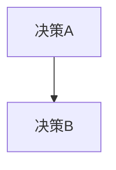

# Canonical Map - 决策图

> 用途：记录所有决策的映射关系和依赖

## 元数据
- 创建日期：2026-03-02
- 维护者：Molt King
- 状态：初始化

## 决策索引

| 决策ID | 标题 | 日期 | 状态 | 依赖 |
|--------|------|------|------|------|
| ... | ... | ... | ... | ... |

## 决策分类

### 架构决策
- 

### 流程决策
- 

### 工具决策
- 

## 决策依赖图

## 待补充
- [ ] 填充现有决策
- [ ] 建立依赖关系
- [ ] 绘制依赖图
